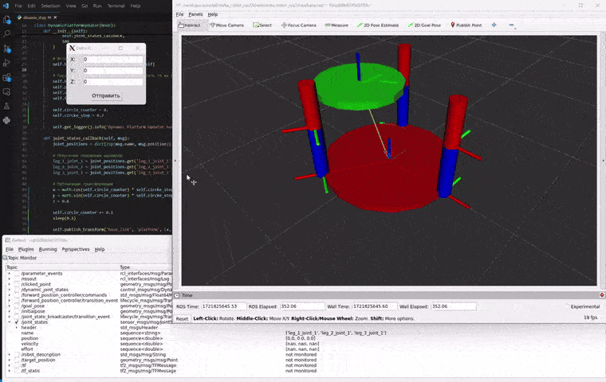

# Delta Robot ROS 2 Simulation



## Project Status

The project is still in progress. The Delta Robot has been modeled, and the interaction mechanism between all ROS components has been set up. However, for accurate simulation, it is necessary to implement the forward kinematics solution and improve the dynamic updating of the robot's links over time, as well as make the movement of the links smoother.

## Project Overview

This project is aimed at simulating a Delta Robot in ROS 2 using `ros2_control` for managing the robot's movements. The robot is defined using URDF and Xacro files, and its movements are visualized using RViz and Gazebo. The primary goal is to create a robust simulation environment for a Delta Robot and develop a control node to manage the actuators of the robot's legs.

## Features

- **URDF/Xacro Model**: Detailed robot description using URDF and Xacro.
- **ROS 2 Control Integration**: Utilizes `ros2_control` for actuator control.
- **Dynamic Visualization**: Real-time visualization in RViz and Gazebo.
- **Inverse Kinematics**: Custom Python node for inverse kinematics and motor control.
- **Forward Kinematics (planned)**: Implementation of forward kinematics solution to enhance simulation accuracy.
- **Dynamic Transformation Updates**: Node for dynamically updating robot link transformations using TF.
- **Smooth Movement (planned)**: Enhancements to make link movements smoother.
- **Graphical User Interface**: Tkinter-based GUI for sending target positions to the robot.
- **Docker Support**: Dockerfile and Docker Compose configuration for containerized development and deployment.


## Getting Started

### Prerequisites

- Docker
- ROS 2 Humble
- Gazebo
- Python 3

### Installation

#### Dokcer

    ```sh
    cd docker
    docker-compose build
    docker-compose up
    ```

#### Project

1. **Clone the repository**:
    ```sh
    git clone https://github.com/AntonSHBK/delta_robot_ros2.git
    cd delta_robot_ros2
    ```

2. **Build the package**:
    ```sh
    colcon build --packages-select delta_robot_ros2
    ```

3. **Source the setup file**:
    ```sh
    source install/setup.bash
    ```

### Running the Simulation

1. **Launch the robot description in RViz**:
    ```sh
    ros2 launch delta_robot_ros2 delta_robot_run.py
    ```

### Project Structure

- `urdf/`: Contains URDF and Xacro files defining the robot.
    - `base.xacro`: Xacro file for the base of the robot.
    - `common_macro.xacro`: Common macros used across the robot's URDF.
    - `delta_robot.xacro`: Main Xacro file for the delta robot.
    - `leg.xacro`: Xacro file defining the legs of the robot.
    - `platform.xacro`: Xacro file for the movable platform.
    - `robot_control.xacro`: Xacro file for robot control configuration.

- `launch/`: Contains launch files for starting the simulation and visualization.
    - `delta_robot_run.py`: Main launch file to run the delta robot simulation.

- `scripts/`: Source files for the custom control node and utilities.
    - `delta_robot_controller.py`: Control node for managing delta robot movements.
    - `dinamic_tf.py`: Node for dynamic transformation updates.
    - `kinematic.py`: Contains kinematic calculations for the delta robot.
    - `user_gui.py`: GUI for sending commands to the delta robot.

- `config/`: Configuration files for controllers and other settings.
    - `delta_robot_controllers.yaml`: Configuration for delta robot controllers.

- `rviz/`: RViz configuration files for visualization.
    - `base.rviz`: RViz configuration file for the delta robot.

- `docker/`: Docker-related files for containerizing the project.
    - `Dockerfile`: Dockerfile for building the project container.
    - `docker-compose.yml`: Docker Compose configuration file.

- `CMakeLists.txt`: CMake configuration file for building the project.
- `LICENSE`: License file for the project.
- `README.md`: This README file.
- `package.xml`: Package configuration file for ROS 2.
- `requirements.txt`: Python dependencies for the project.

## Useful Resources

- **ROS 2 Documentation**: [https://docs.ros.org/en/humble/index.html](https://docs.ros.org/en/humble/index.html)
- **ros2_control Documentation**: [https://control.ros.org/](https://control.ros.org/)
- **Gazebo Documentation**: [http://gazebosim.org/tutorials](http://gazebosim.org/tutorials)
- **TF2 Documentation**: [http://wiki.ros.org/tf2](http://wiki.ros.org/tf2)
- **URDF Documentation**: [http://wiki.ros.org/urdf](http://wiki.ros.org/urdf)
- **Xacro Documentation**: [http://wiki.ros.org/xacro](http://wiki.ros.org/xacro)

## Contacts

For questions or support, please contact:

- **Name**: Pisarenko Anton
- **Email**: anton42@yandex.ru
- **Telegram**: [antonSHBK](https://t.me/antonSHBK)

## Citation

If you use this work in your research, please cite it as follows:

```latex
@misc{yourname2024deltarobot,
  author = {Pisarenko Anton},
  title = {Delta Robot ROS 2 Simulation},
  year = {2024},
  publisher = {GitHub},
  journal = {GitHub repository},
  howpublished = {\url{https://github.com/AntonSHBK/delta_robot_ros2}},
}
